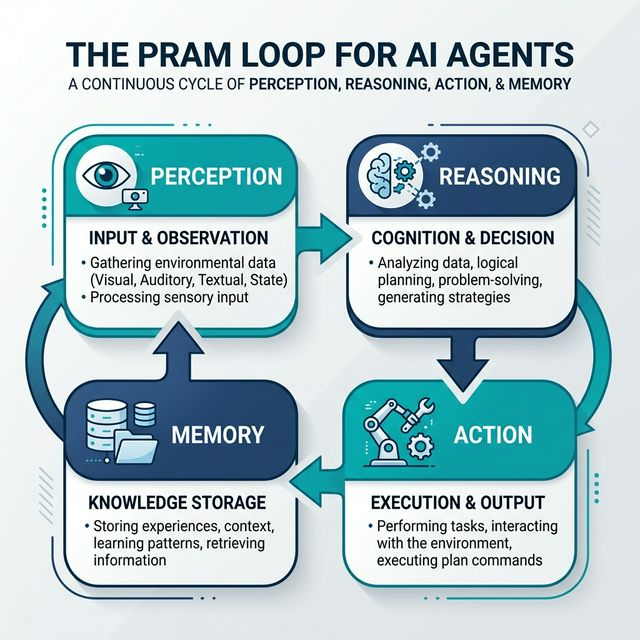
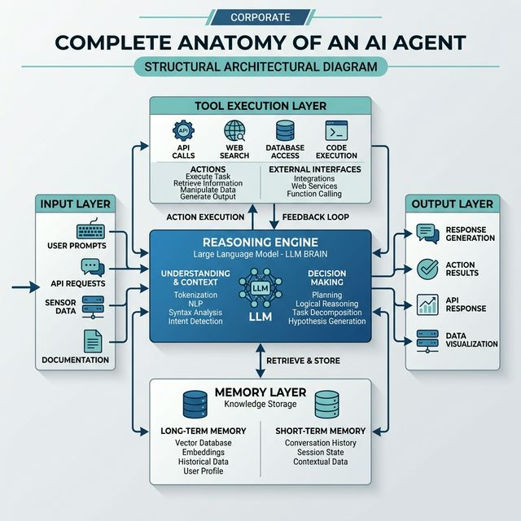

# 03 — Agent Anatomy & The PRAM Loop

> *Every AI agent, regardless of framework, follows this fundamental loop.*

---

## 3.1 The PRAM Loop



The agent loop runs continuously until a **termination condition** is met:
- Goal achieved
- Max steps reached
- Human interruption
- Irrecoverable error

---

## 3.2 P — Perception (Input Processing)

### What It Is
The agent receives and processes inputs from its environment. This is NOT just user text — it includes everything the agent can observe.

### Input Sources
| Source | Examples |
|---|---|
| User input | Natural language query, instruction, feedback |
| Tool output | Web search results, database rows, API responses |
| System state | Previous messages, agent scratchpad, current plan |
| Environment | File contents, code output, error messages, images |

### Key Operations in Perception
1. **Tokenization** — converting raw text to tokens the LLM processes
2. **Context assembly** — merging system prompt + history + current input + tool results into one context window
3. **Relevance filtering** — deciding what information is important enough to include
4. **Format parsing** — parsing structured tool outputs (JSON, XML, tables)

### Why Perception Is Non-Trivial
- Context windows are finite — you can't include everything
- Tool outputs can be noisy — agents need to extract signal from noise
- Multimodal inputs add complexity (images, audio, PDFs)

---

## 3.3 R — Reasoning (The LLM Brain)

### What It Is
The core cognitive layer — the LLM processes the assembled context and produces a **thought + action decision**.

### What Happens During Reasoning
1. **Understanding**: Parse the current goal and constraints
2. **Recall**: Query memory for relevant past experience
3. **Planning**: Determine next best action or sub-plan
4. **Decision**: Select specific action + parameters
5. **Generation**: Output thought + action in structured format

### The Scratchpad (Chain-of-Thought)
Most production agents use a **scratchpad** — a running internal monologue:

```
Thought: I need to find the current price of Bitcoin.
         I should use the web_search tool.
Action: web_search("Bitcoin price today USD")
```

This intermediate reasoning makes the agent's logic transparent and debuggable.

### Reasoning Modes
| Mode | Description |
|---|---|
| **Direct answer** | Agent responds without tool use (knowledge is sufficient) |
| **Tool selection** | Agent picks a tool and formats call |
| **Plan generation** | Agent creates a multi-step plan |
| **Reflection** | Agent evaluates its own previous output |

---

## 3.4 A — Action (Execution)

### What It Is
The agent executes the decision made during reasoning. Actions bridge the digital boundary between the agent and the world.

### Categories of Actions
```
READ Actions          WRITE Actions         CONTROL Actions
─────────────         ─────────────         ───────────────
web_search()          send_email()          spawn_agent()
query_db()            write_file()          end_task()
read_file()           execute_code()        escalate_human()
call_api()            post_to_api()         update_plan()
```

### Tool Call Anatomy
```json
{
  "tool_name": "web_search",
  "parameters": {
    "query": "Bitcoin price today",
    "num_results": 5
  }
}
```

The framework:
1. Parses the LLM's tool call output
2. Routes to the correct tool function
3. Executes with provided parameters
4. Returns the result as an observation

### Action Safety
Not all actions are equal in risk:
- **Reversible**: read operations, drafting text → safe to auto-execute
- **Semi-reversible**: database writes, emails → require validation
- **Irreversible**: financial transactions, deletions → require human approval

---

## 3.5 M — Memory (State & Knowledge)

### What It Is
The agent's ability to **store and retrieve information** across time — within a session and across sessions.

### Memory Architecture

```
┌────────────────────────────────────────────────────────────┐
│                    AGENT MEMORY SYSTEM                     │
├─────────────────────┬──────────────────────────────────────┤
│   IN-CONTEXT (STM)  │       EXTERNAL (LTM)                 │
│   ─────────────     │       ──────────────                 │
│   • Conversation    │       • Vector Store (episodic)      │
│     history         │       • SQL/NoSQL DB (structured)    │
│   • Current plan    │       • Knowledge Graph (relational) │
│   • Scratchpad      │       • File System (documents)      │
│   • Tool results    │                                      │
└─────────────────────┴──────────────────────────────────────┘
```

### Memory Types Explained

**Short-Term Memory (STM)**
- Lives inside the context window
- The conversation buffer: all messages in current session
- Cleared when session ends (unless persisted)

**Long-Term Memory (LTM)**
- Stored externally (vector database, SQL, graph DB)
- Retrieved by similarity search or key lookup
- Persists across sessions

**Episodic Memory**
- Log of past agent runs stored and made retrievable
- "What did I do last time this user asked about X?"

**Semantic Memory**
- Factual knowledge base: product docs, company policies, FAQs
- Classic RAG territory

**Procedural Memory**
- Learned workflows, reusable sub-routines, skill library
- Agent discovers effective tool sequences → saves them for reuse

---

## 3.6 Complete Anatomy Diagram



---

## 3.7 The Termination Conditions

The PRAM loop needs a well-defined exit:

| Condition | Description |
|---|---|
| **Goal reached** | Agent determines it has completed the task |
| **Max iterations** | Hard cap on loop count (prevents infinite loops) |
| **Human interrupt** | HITL checkpoint — user reviews before next step |
| **Tool failure** | Unrecoverable error, agent reports failure |
| **Confidence threshold** | Agent uncertainty too high — escalate to human |

---

## 📌 Key Takeaways

1. Every agent — regardless of framework — implements the **PRAM loop**
2. **Reasoning** (the LLM) is the brain; **memory** is its state; **tools** are its hands
3. **Context assembly** is often the most critical engineering challenge
4. Always define **termination conditions** — unbounded loops are bugs, not features
