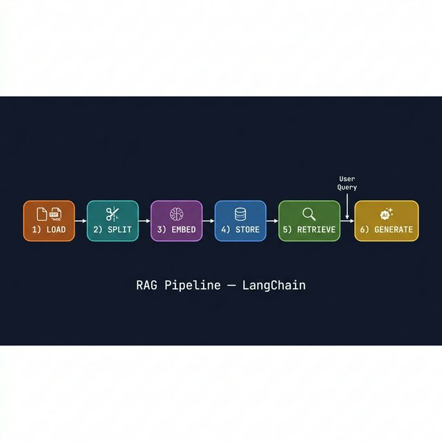

# The Full RAG Pipeline

> *Walk through all 6 steps of a production RAG pipeline — from raw documents to grounded LLM answers.*

---

## 🗺️ Pipeline Overview



---

## Step 1 — LOAD: Ingest Documents

```python
from langchain_community.document_loaders import PyPDFLoader, WebBaseLoader
from langchain_core.documents import Document

# Option A: PDF
loader = PyPDFLoader("knowledge_base.pdf")
raw_docs = loader.load()

# Option B: Web pages
loader = WebBaseLoader([
    "https://yoursite.com/faq",
    "https://yoursite.com/docs",
])
raw_docs = loader.load()

# Option C: Multiple sources combined
from langchain_community.document_loaders import DirectoryLoader
loader = DirectoryLoader("./docs/", glob="**/*.pdf", loader_cls=PyPDFLoader)
raw_docs = loader.load()

print(f"Loaded: {len(raw_docs)} documents")
print(f"Total: {sum(len(d.page_content) for d in raw_docs):,} characters")
```

---

## Step 2 — SPLIT: Chunk Documents

```python
from langchain_text_splitters import RecursiveCharacterTextSplitter

splitter = RecursiveCharacterTextSplitter(
    chunk_size=1000,      # Max characters per chunk
    chunk_overlap=200,    # Overlap to avoid missing context at boundaries
    length_function=len,
    add_start_index=True  # Adds 'start_index' to metadata
)

chunks = splitter.split_documents(raw_docs)

print(f"Chunks created: {len(chunks)}")
print(f"Avg chunk size: {sum(len(c.page_content) for c in chunks)//len(chunks)} chars")
print(f"Sample metadata: {chunks[0].metadata}")
# {'source': 'doc.pdf', 'page': 0, 'start_index': 0}
```

---

## Step 3 — EMBED: Convert to Vectors

```python
from langchain_openai import OpenAIEmbeddings

embeddings = OpenAIEmbeddings(
    model="text-embedding-3-small"   # 1536-dimensional vectors
)

# Test embedding
test_vec = embeddings.embed_query("test query")
print(f"Vector dimensions: {len(test_vec)}")
# Embeddings happen automatically when you call from_documents below
```

---

## Step 4 — STORE: Index in Vector Database

```python
from langchain_chroma import Chroma

# Embeds all chunks and stores in Chroma
vectorstore = Chroma.from_documents(
    documents=chunks,
    embedding=embeddings,
    persist_directory="./rag_vectorstore",   # Persist to disk
    collection_name="knowledge-base"
)

print(f"Indexed: {vectorstore._collection.count()} chunks")
```

---

## Step 5 — RETRIEVE: Semantic Search

```python
# Create a retriever from the vector store
retriever = vectorstore.as_retriever(
    search_type="mmr",              # MMR for diverse results
    search_kwargs={
        "k": 4,                     # Return top 4 chunks
        "fetch_k": 20,              # Fetch 20 candidates for MMR
        "lambda_mult": 0.5          # Balance relevance vs diversity
    }
)

# Test retrieval
query = "What is the refund policy?"
retrieved_docs = retriever.invoke(query)

print(f"Retrieved: {len(retrieved_docs)} chunks")
for i, doc in enumerate(retrieved_docs, 1):
    print(f"\n[{i}] Source: {doc.metadata.get('source', 'unknown')}")
    print(f"    Content: {doc.page_content[:150]}...")
```

---

## Step 6 — GENERATE: LLM with Context

```python
from langchain_openai import ChatOpenAI
from langchain_core.prompts import ChatPromptTemplate
from langchain_core.output_parsers import StrOutputParser
from langchain_core.runnables import RunnablePassthrough

llm = ChatOpenAI(model="gpt-4o-mini", temperature=0)

# RAG prompt — context + question
rag_prompt = ChatPromptTemplate.from_messages([
    ("system", """You are a helpful assistant. Answer the user's question 
using ONLY the following context. If the answer isn't in the context, 
say "I don't have that information in my knowledge base."

Context:
{context}"""),
    ("human", "{question}")
])

def format_docs(docs: list) -> str:
    """Format retrieved docs into a context string."""
    parts = []
    for i, doc in enumerate(docs, 1):
        source = doc.metadata.get("source", "unknown")
        page   = doc.metadata.get("page", "")
        header = f"[Source {i}: {source}" + (f", page {page}]" if page else "]")
        parts.append(f"{header}\n{doc.page_content}")
    return "\n\n---\n\n".join(parts)

# Build complete RAG chain
rag_chain = (
    {
        "context":  retriever | format_docs,   # retrieve → format
        "question": RunnablePassthrough()        # pass question through
    }
    | rag_prompt
    | llm
    | StrOutputParser()
)

# Use it
answer = rag_chain.invoke("What is the refund policy?")
print(answer)
```

---

## 🔗 Complete RAG Pipeline — All Together

```python
import os
from langchain_community.document_loaders import PyPDFLoader
from langchain_text_splitters import RecursiveCharacterTextSplitter
from langchain_openai import OpenAIEmbeddings, ChatOpenAI
from langchain_chroma import Chroma
from langchain_core.prompts import ChatPromptTemplate
from langchain_core.output_parsers import StrOutputParser
from langchain_core.runnables import RunnablePassthrough
from dotenv import load_dotenv

load_dotenv()

# ── INDEXING ──────────────────────────────────────────────────
loader    = PyPDFLoader("your_document.pdf")
raw_docs  = loader.load()

splitter  = RecursiveCharacterTextSplitter(chunk_size=1000, chunk_overlap=200)
chunks    = splitter.split_documents(raw_docs)

embeddings   = OpenAIEmbeddings(model="text-embedding-3-small")
vectorstore  = Chroma.from_documents(chunks, embeddings, persist_directory="./db")

# ── RETRIEVAL ─────────────────────────────────────────────────
retriever = vectorstore.as_retriever(search_type="mmr", search_kwargs={"k": 4})

# ── GENERATION ───────────────────────────────────────────────
llm = ChatOpenAI(model="gpt-4o-mini", temperature=0)
prompt = ChatPromptTemplate.from_messages([
    ("system", "Answer using only this context:\n\n{context}"),
    ("human",  "{question}")
])

def format_docs(docs): return "\n\n".join(d.page_content for d in docs)

chain = (
    {"context": retriever | format_docs, "question": RunnablePassthrough()}
    | prompt | llm | StrOutputParser()
)

# ── QUERY ─────────────────────────────────────────────────────
while True:
    q = input("\nQuestion (q to quit): ")
    if q.lower() == "q": break
    print(chain.invoke(q))
```

---

## 🔧 Pipeline Optimization Checklist

```
Indexing:
✅ chunk_size tuned to document type (500-1500 typical)
✅ chunk_overlap set to ~20% of chunk_size
✅ Metadata preserved and enriched (source, date, category)
✅ Tested with random sample chunks — semantically coherent?

Retrieval:
✅ MMR vs similarity — tested both on your data
✅ k=4 is a good default (increase for complex questions)
✅ fetch_k = 3-5× k for MMR to work well
✅ Score threshold set for high-precision use cases

Generation:
✅ System prompt says "use ONLY the context"
✅ Explicit "I don't know" instruction for out-of-scope questions
✅ Temperature=0 for factual Q&A
✅ Source attribution included in output
```

---

## ✅ Key Takeaways

- **6 steps**: Load → Split → Embed → Store → Retrieve → Generate
- **Indexing** (steps 1-4) runs once; **querying** (5-6) runs per user request
- `format_docs()` is crucial — transform `List[Document]` into a readable context string
- Always set `temperature=0` for factual RAG to minimize hallucination
- Instruct the LLM explicitly: "Answer ONLY using the context"
- Test your retrieval before worrying about generation

---

## ➡️ Next
[Retrieval Chain API →](./03_retrieval_chain.md)
