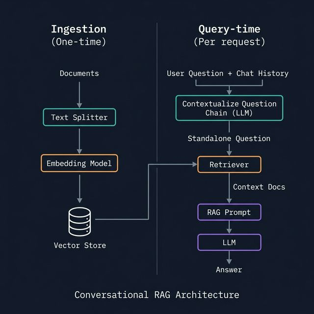

# Conversational RAG

> *Plain RAG is stateless — each question is independent. Conversational RAG adds chat history so the LLM understands follow-up questions in context.*

---

## 🔴 The Problem: Stateless RAG

```
User: "What are LangChain tools?"
Bot:  "LangChain tools are functions that agents can call..."

User: "How do I create one?"    ← "one" = tool (from previous turn)
Bot:  ???   ← Doesn't know "one" refers to "tool" — each turn is independent!
```

Plain RAG treats every question independently — no memory of prior turns.

---

## 💡 The Solution: Question Contextualization

Before retrieving, **reformulate the question** using chat history so it becomes standalone:

```
Chat history: [User: "What are LangChain tools?", AI: "Tools are..."]
New question: "How do I create one?"

Contextualized: "How do I create a LangChain tool?"
→ NOW we can retrieve relevant docs correctly!
```

---

## 🏗️ Conversational RAG Architecture



---

## 📐 Implementation

### Step 1 — Contextualize Question Chain

```python
from langchain.chains import create_history_aware_retriever
from langchain_core.prompts import ChatPromptTemplate, MessagesPlaceholder
from langchain_openai import ChatOpenAI

llm = ChatOpenAI(model="gpt-4o-mini", temperature=0)

# This prompt reformulates the question using chat history
contextualize_q_prompt = ChatPromptTemplate.from_messages([
    ("system", """Given a chat history and the latest user question,
reformulate it into a standalone question that can be understood WITHOUT 
the chat history. Do NOT answer the question — just reformulate it if needed, 
otherwise return it as-is."""),
    MessagesPlaceholder("chat_history"),  # ← History injected here
    ("human", "{input}"),
])

# Wrap retriever: it will contextualize before retrieving
history_aware_retriever = create_history_aware_retriever(
    llm,
    retriever,          # Your vector store retriever
    contextualize_q_prompt
)
```

### Step 2 — RAG Chain with History

```python
from langchain.chains import create_retrieval_chain
from langchain.chains.combine_documents import create_stuff_documents_chain

# RAG prompt — now includes chat history
rag_prompt = ChatPromptTemplate.from_messages([
    ("system", """You are a helpful assistant. Answer using ONLY the context below.
If you don't know, say so.

<context>
{context}
</context>"""),
    MessagesPlaceholder("chat_history"),   # ← History for multi-turn awareness
    ("human", "{input}"),
])

document_chain     = create_stuff_documents_chain(llm, rag_prompt)
conversational_rag = create_retrieval_chain(history_aware_retriever, document_chain)
```

### Step 3 — Manage History Manually

```python
from langchain_core.messages import HumanMessage, AIMessage

chat_history = []   # Start with empty history

def chat(question: str) -> str:
    result = conversational_rag.invoke({
        "input":        question,
        "chat_history": chat_history
    })
    answer = result["answer"]

    # Append this turn to history
    chat_history.append(HumanMessage(content=question))
    chat_history.append(AIMessage(content=answer))

    return answer

# Multi-turn conversation
print(chat("What are LangChain tools?"))
print(chat("How do I create one?"))          # "one" = tool — resolved via history
print(chat("Can you give a Python example?")) # "example" of creating tool
```

---

## 🧠 Auto-Managed History with `RunnableWithMessageHistory`

For web apps / APIs — automatically save and load history per session:

```python
from langchain_core.runnables.history import RunnableWithMessageHistory
from langchain_community.chat_message_histories import ChatMessageHistory
from langchain_core.chat_history import BaseChatMessageHistory

# In-memory store (replace with Redis/DB in production)
store: dict[str, ChatMessageHistory] = {}

def get_session_history(session_id: str) -> BaseChatMessageHistory:
    if session_id not in store:
        store[session_id] = ChatMessageHistory()
    return store[session_id]

# Wrap the chain with auto history management
chain_with_history = RunnableWithMessageHistory(
    conversational_rag,
    get_session_history,
    input_messages_key="input",
    history_messages_key="chat_history",
    output_messages_key="answer",
)

# Different sessions maintain separate histories
config_user1 = {"configurable": {"session_id": "user-alice"}}
config_user2 = {"configurable": {"session_id": "user-bob"}}

# Alice's conversation
print(chain_with_history.invoke({"input": "What is LangGraph?"}, config=config_user1)["answer"])
print(chain_with_history.invoke({"input": "How does it differ from LangChain?"}, config=config_user1)["answer"])

# Bob's separate conversation (independent history)
print(chain_with_history.invoke({"input": "How do I install LangChain?"}, config=config_user2)["answer"])
```

---

## 💾 Persistent History (Production)

Replace `ChatMessageHistory` (in-memory) with a persistent backend:

```python
# Redis (for production APIs)
from langchain_community.chat_message_histories import RedisChatMessageHistory

def get_session_history(session_id: str) -> RedisChatMessageHistory:
    return RedisChatMessageHistory(
        session_id=session_id,
        url="redis://localhost:6379",
        ttl=3600  # 1 hour TTL
    )

# SQLite (local persistent)
from langchain_community.chat_message_histories import SQLChatMessageHistory

def get_session_history(session_id: str) -> SQLChatMessageHistory:
    return SQLChatMessageHistory(
        session_id=session_id,
        connection_string="sqlite:///chat_history.db"
    )
```

---

## 🔒 History Window — Limit Context Size

Very long histories can exceed the context window. Trim to recent N turns:

```python
from langchain_core.messages import trim_messages, HumanMessage, AIMessage

# Keep only the last 10 messages
def trim_history(history: list, max_messages: int = 10) -> list:
    return history[-max_messages:]

def chat_trimmed(question: str) -> str:
    result = conversational_rag.invoke({
        "input":        question,
        "chat_history": trim_history(chat_history)  # Trimmed!
    })
    answer = result["answer"]
    chat_history.extend([
        HumanMessage(content=question),
        AIMessage(content=answer)
    ])
    return answer
```

---

## ✅ Key Takeaways

- **History-aware retriever** = reformulates question before retrieval using chat history
- `create_history_aware_retriever(llm, retriever, prompt)` handles contextualization
- `MessagesPlaceholder("chat_history")` injects the history into prompts
- Manual history: append `HumanMessage` + `AIMessage` after each turn
- **`RunnableWithMessageHistory`** automates history storage per session_id
- In production, use Redis or SQLite backend — not in-memory dict

---

## ➡️ Next
[Chatbot Project →](./05_chatbot_project.md)
